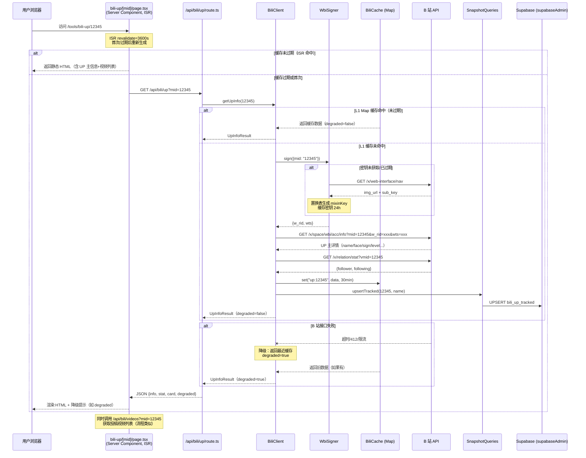
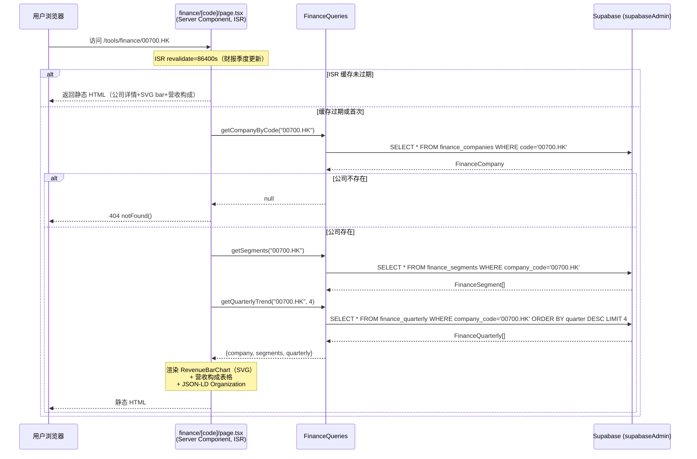
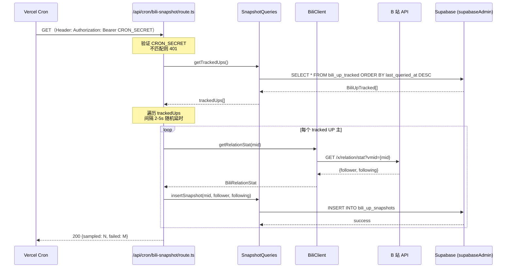
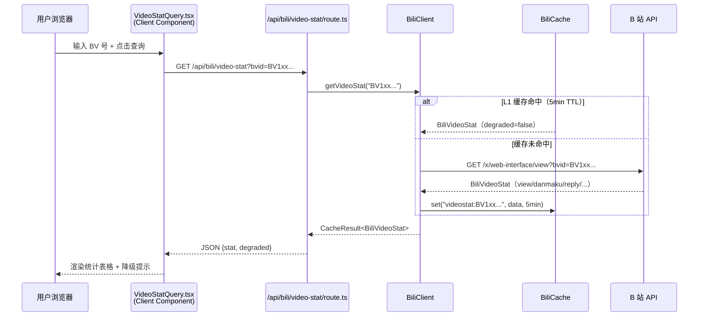
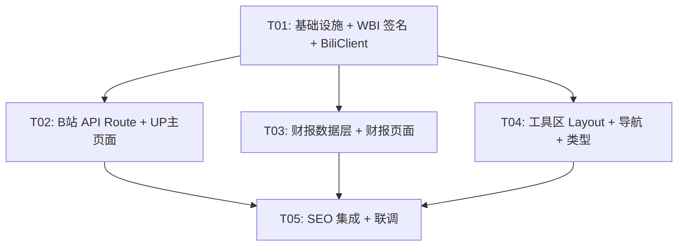

# B 站 / 游戏产业数据查询工具 — 系统架构设计

> 文档日期：2026-09-08
> 架构师：Bob
> 载体项目：AkkunSpace（C:\Users\26336\akkun-space）
> 前置文档：bilibili-data-research-2026-09-08.md（市场调研）、bilibili-data-prd-2026-09-08.md（PRD）

---

## 1. 实现方案

### 1.1 整体方案

在 AkkunSpace 现有 Next.js 16 + React 19 + TS + Tailwind v4 + Supabase 栈上共生两个工具子模块，路径挂载在 `app/tools/` 下。不引入新框架、新状态管理库、新 UI 库、新图表库。

核心架构决策：

| 决策点 | 方案 | 理由 |
|---|---|---|
| B 站数据获取 | 服务端 API Route 代理，客户端不接触 WBI 签名 | 签名逻辑是命门，不暴露到客户端 bundle |
| WBI 签名 | 自实现 `lib/bili/wbi.ts`，纯 Node.js `crypto` 模块，零第三方依赖 | 命门不能外包给第三方库，需单测覆盖 |
| 缓存 | Next.js `unstable_cache` + 模块级 Map TTL 双层 | Vercel 数据缓存做跨实例持久，Map 做同实例快速命中 |
| 降级 | B 站接口失效 → 返回最近缓存 + `degraded` 标记；财报工具完全独立 | B 站挂了财报速查还能用 |
| 快照存储 | Supabase `bili_up_snapshots` 表，Vercel Cron 每日采样被查询过的 UP 主 | 避免无意义全量采样 |
| 财报数据 | 手动录入 / CSV 导入 Supabase，ISR 静态页查询 | 季度更新，手动维护成本远低于抓取 |
| 图表 | 纯 SVG/CSS bar 组件，不引 Recharts/ECharts | PRD 约束 + 零依赖 |
| SEO | ISR + sitemap 扩展 + JSON-LD（Person/Organization） | 长尾词排名基础 |

### 1.2 核心技术挑战与对策

| 挑战 | 难度 | 对策 |
|---|---|---|
| WBI 签名自实现（密钥轮换 + 置换表 + MD5） | 高 | 纯 Node `crypto` 实现，独立模块 + 单测覆盖置换表正确性；密钥每日从 `/x/web-interface/nav` 动态获取并缓存 |
| B 站接口频次控制（未登录 30-50 次/分钟） | 中 | 服务端 `unstable_cache` TTL 缓存 + 请求间随机延时 2-5s + 降级返回缓存 |
| Vercel Serverless 缓存一致性 | 中 | `unstable_cache` 走 Vercel Data Cache（跨实例），模块级 Map 做同实例 L1；不强求一致，降级容忍 |
| 财报 CSV 导入脚本避开 `server-only` 约束 | 低 | 脚本直连 Supabase（`@supabase/supabase-js` createClient），不走 `lib/interaction/supabase-storage.ts`（该模块顶部 `server-only` 在 tsx 下 throw） |

### 1.3 架构模式

沿用 AkkunSpace 现有模式：
- **App Router** 文件路由（`app/tools/` 子路径）
- **Server Component 优先**：详情页用 Server Component + ISR，查询页用 Client Component（交互）
- **API Route 做服务端代理**：与现有 `app/api/guestbook`、`app/api/music/url` 模式一致
- **lib 分包按业务域**：新增 `lib/bili/` 和 `lib/tools/` 两个业务域，遵循现有 `lib/` 分包纪律

---

## 2. 文件列表

### 2.1 新建文件

#### lib/bili/ — B 站数据业务域

| 文件 | 用途 | 边界 |
|---|---|---|
| `lib/bili/types.ts` | B 站 API 响应类型定义（纯类型） | 客户端可用，经 index.ts re-export |
| `lib/bili/wbi.ts` | WBI 签名实现（MIXIN_KEY_ENC_TAB 置换 + MD5） | `server-only`，不进客户端 bundle |
| `lib/bili/client.ts` | B 站 API 客户端（签名 + 请求 + 缓存 + 降级） | `server-only`，不进客户端 bundle |
| `lib/bili/cache.ts` | 模块级 Map TTL 缓存（L1 同实例快速命中） | `server-only`，不进客户端 bundle |
| `lib/bili/index.ts` | 聚合入口，只 re-export types.ts | 客户端可用 |

#### lib/tools/ — 工具共享业务域

| 文件 | 用途 | 边界 |
|---|---|---|
| `lib/tools/types.ts` | 工具页 Props / 渲染数据类型定义（纯类型） | 客户端可用，经 index.ts re-export |
| `lib/tools/finance-data.ts` | 12 家游戏公司静态配置（名称/代码/市场） | 客户端可用，经 index.ts re-export |
| `lib/tools/finance-queries.ts` | 财报数据 Supabase 查询（公司列表/详情/趋势/构成） | `server-only`，用 supabaseAdmin |
| `lib/tools/snapshot-queries.ts` | UP 主快照 Supabase 查询/写入（追踪/采样） | `server-only`，用 supabaseAdmin |
| `lib/tools/index.ts` | 聚合入口，只 re-export types.ts + finance-data.ts | 客户端可用 |

#### app/tools/ — 工具页面路由

| 文件 | 用途 | 类型 |
|---|---|---|
| `app/tools/layout.tsx` | 工具区共享布局（工具子导航 + GlassPage） | Server Component |
| `app/tools/page.tsx` | 工具入口页（两个工具卡片导航） | Server Component |
| `app/tools/bili-up/page.tsx` | UP 主查询入口页（mid 输入框 + 查询） | Client Component |
| `app/tools/bili-up/[mid]/page.tsx` | UP 主详情页（ISR 1h + JSON-LD Person） | Server Component |
| `app/tools/finance/page.tsx` | 财报速查列表页（ISR daily + 公司表格） | Server Component |
| `app/tools/finance/[code]/page.tsx` | 公司详情页（ISR daily + SVG bar + JSON-LD Organization） | Server Component |

#### app/api/ — API Route 服务端代理

| 文件 | 用途 |
|---|---|
| `app/api/bili/up/route.ts` | UP 主信息 + 粉丝数代理（GET ?mid=xxx） |
| `app/api/bili/videos/route.ts` | UP 主投稿视频列表代理（GET ?mid=xxx&page=1） |
| `app/api/bili/video-stat/route.ts` | 单视频统计代理（GET ?bvid=xxx） |
| `app/api/cron/bili-snapshot/route.ts` | Vercel Cron 每日快照采样（GET，CRON_SECRET 鉴权） |

#### app/components/tools/ — 工具专用组件

| 文件 | 用途 | 类型 |
|---|---|---|
| `app/components/tools/UpSearchBox.tsx` | UP 主 mid 搜索输入框组件 | Client Component |
| `app/components/tools/VideoStatQuery.tsx` | 视频统计查询内嵌组件（BV 号输入） | Client Component |
| `app/components/tools/VideoList.tsx` | 投稿视频列表表格组件 | Server Component |
| `app/components/tools/RevenueBarChart.tsx` | 季度营收 SVG bar 图组件 | Server Component |
| `app/components/tools/CompanyTable.tsx` | 公司列表表格组件 | Server Component |

#### scripts/ — 数据维护脚本

| 文件 | 用途 |
|---|---|
| `scripts/import-finance-csv.ts` | 财报 CSV 导入 Supabase 脚本（tsx 运行，直连 Supabase） |

#### supabase/ — 数据库 DDL

| 文件 | 用途 |
|---|---|
| `supabase/migrations/001_bili_snapshots.sql` | B 站快照 + 追踪表 DDL + RLS |
| `supabase/migrations/002_finance_tables.sql` | 财报三表 DDL + RLS |

#### 配置文件

| 文件 | 用途 |
|---|---|
| `vercel.json` | Vercel Cron 每日快照任务配置 |

### 2.2 修改文件

| 文件 | 修改内容 |
|---|---|
| `data/site/nav.json` | 新增"工具"导航项（href: `/tools`, inNav: true） |
| `app/sitemap.ts` | 新增工具页路由到 sitemap 输出 |
| `app/components/StructuredData.tsx` | 扩展支持 `organization` 类型（JSON-LD） |

### 2.3 复用文件（不改）

| 文件 | 复用方式 |
|---|---|
| `lib/interaction/supabase-storage.ts` | 工具服务端查询用 `supabaseAdmin`（绕 RLS） |
| `lib/interaction/supabase.ts` | 工具客户端如需留言互动用 `supabase`（anon key） |
| `app/components/GlassPage.tsx` | 工具页统一用 GlassPage 容器 |
| `lib/utils/formatDate.ts` | 日期格式化 |
| `app/components/Header.tsx` | 导航新增"工具"项后自动展示（navItems 数据驱动） |

---

## 3. 数据结构和接口

### 3.1 类图

```mermaid
classDiagram
    %% ============ B 站 API 类型 ============
    class BiliUpInfo {
        +mid: number
        +name: string
        +face: string
        +sign: string
        +level: number
        +official_verify: boolean
        +vip_type: number
        +vip_status: number
        +live_room: LiveRoomInfo
    }

    class BiliRelationStat {
        +mid: number
        +following: number
        +follower: number
        +whisper: number
    }

    class BiliUpCard {
        +card: UpCardInfo
        +following: boolean
    }

    class UpCardInfo {
        +mid: string
        +name: string
        +fans: number
        +attention: number
        +archive_count: number
        +article_count: number
    }

    class BiliVideoItem {
        +bvid: string
        +aid: number
        +title: string
        +play: number
        +video_review: number
        +danmaku: number
        +reply: number
        +favorite: number
        +coin: number
        +share: number
        +like: number
        +created: number
        +length: string
        +pic: string
    }

    class BiliVideoListResponse {
        +list: VideoListData
    }

    class VideoListData {
        +vlist: BiliVideoItem[]
        +tlist: Record~string, TlistItem~
        +page: PageInfo
    }

    class PageInfo {
        +pn: number
        +ps: number
        +count: number
    }

    class BiliVideoStat {
        +bvid: string
        +aid: number
        +view: number
        +danmaku: number
        +reply: number
        +favorite: number
        +coin: number
        +share: number
        +like: number
        +now_rank: number
        +his_rank: number
    }

    class LiveRoomInfo {
        +roomStatus: number
        +liveStatus: number
        +url: string
        +title: string
        +cover: string
        +roomid: number
    }

    class TlistItem {
        +tid: number
        +count: number
        +name: string
    }

    %% ============ WBI 签名 ============
    class WbiSigner {
        -imgKey: string
        -subKey: string
        -mixinKey: string
        -keyFetchedAt: number
        -KEY_CACHE_TTL: number
        +ensureKeys() void
        -fetchNavKeys() Promise~void~
        -getMixinKey(orig: string) string
        +sign(params: Record~string,string~) Promise~WbiSignResult~
    }

    class WbiSignResult {
        +w_rid: string
        +wts: number
    }

    %% ============ B 站 API 客户端 ============
    class BiliClient {
        -signer: WbiSigner
        -cache: BiliCache
        -BASE_URL: string
        +getUpInfo(mid: number) Promise~UpInfoResult~
        +getRelationStat(mid: number) Promise~BiliRelationStat~
        +getUpVideos(mid: number, page: number) Promise~BiliVideoListResponse~
        +getVideoStat(bvid: string) Promise~BiliVideoStat~
        -request(path: string, params: Record~string,string~, useWbi: boolean) Promise~any~
        -cachedFetch(cacheKey: string, ttl: number, fetcher: Function) Promise~CacheResult~
    }

    class UpInfoResult {
        +info: BiliUpInfo
        +stat: BiliRelationStat
        +card: BiliUpCard
        +degraded: boolean
        +cachedAt: number
    }

    class CacheResult~T~ {
        +data: T
        +degraded: boolean
        +cachedAt: number
    }

    %% ============ 缓存 ============
    class BiliCache {
        -store: Map~string, CacheEntry~
        +get~T~(key: string) T | null
        +set(key: string, data: any, ttl: number) void
        +isExpired(key: string) boolean
        +clear() void
    }

    class CacheEntry {
        +data: any
        +expiresAt: number
    }

    %% ============ Supabase 快照 ============
    class BiliUpSnapshot {
        +id: string
        +mid: number
        +follower_count: number
        +following_count: number
        +sampled_at: string
        +created_at: string
    }

    class BiliUpTracked {
        +mid: number
        +name: string
        +last_queried_at: string
        +created_at: string
    }

    class SnapshotQueries {
        +supabaseAdmin: SupabaseClient
        +upsertTracked(mid: number, name: string) Promise~void~
        +getTrackedUps() Promise~BiliUpTracked[]~
        +insertSnapshot(mid: number, follower: number, following: number) Promise~void~
        +getSnapshots(mid: number, limit: number) Promise~BiliUpSnapshot[]~
    }

    %% ============ 财报数据 ============
    class FinanceCompany {
        +code: string
        +name: string
        +market: string
        +game_revenue: number
        +total_revenue: number
        +yoy_growth: number
        +ratio: number
        +period: string
        +updated_at: string
    }

    class FinanceSegment {
        +id: string
        +company_code: string
        +segment_name: string
        +revenue: number
        +yoy_growth: number
        +period: string
    }

    class FinanceQuarterly {
        +id: string
        +company_code: string
        +quarter: string
        +game_revenue: number
    }

    class FinanceQueries {
        +supabaseAdmin: SupabaseClient
        +getAllCompanies() Promise~FinanceCompany[]~
        +getCompanyByCode(code: string) Promise~FinanceCompany | null~
        +getSegments(code: string) Promise~FinanceSegment[]~
        +getQuarterlyTrend(code: string, limit: number) Promise~FinanceQuarterly[]~
    }

    %% ============ 工具页渲染数据 ============
    class UpDetailPageData {
        +info: BiliUpInfo
        +stat: BiliRelationStat
        +card: BiliUpCard
        +videos: BiliVideoItem[]
        +videoTotal: number
        +degraded: boolean
    }

    class CompanyDetailPageData {
        +company: FinanceCompany
        +segments: FinanceSegment[]
        +quarterly: FinanceQuarterly[]
    }

    %% ============ 关系 ============
    WbiSigner --> WbiSignResult : produces
    BiliClient --> WbiSigner : uses
    BiliClient --> BiliCache : uses
    BiliClient --> UpInfoResult : produces
    BiliClient ..> BiliUpInfo : fetches
    BiliClient ..> BiliRelationStat : fetches
    BiliClient ..> BiliVideoListResponse : fetches
    BiliClient ..> BiliVideoStat : fetches
    BiliUpInfo --> LiveRoomInfo : contains
    BiliVideoListResponse --> VideoListData : contains
    VideoListData --> BiliVideoItem : contains list
    VideoListData --> PageInfo : contains
    SnapshotQueries --> BiliUpSnapshot : manages
    SnapshotQueries --> BiliUpTracked : manages
    FinanceQueries --> FinanceCompany : manages
    FinanceQueries --> FinanceSegment : manages
    FinanceQueries --> FinanceQuarterly : manages
    UpDetailPageData --> BiliUpInfo
    UpDetailPageData --> BiliRelationStat
    UpDetailPageData --> BiliVideoItem
    CompanyDetailPageData --> FinanceCompany
    CompanyDetailPageData --> FinanceSegment
    CompanyDetailPageData --> FinanceQuarterly
```



### 3.2 Supabase 表结构

#### 表 1：bili_up_snapshots（UP 主粉丝快照）

| 列 | 类型 | 约束 | 说明 |
|---|---|---|---|
| id | uuid | PK, default gen_random_uuid() | |
| mid | bigint | NOT NULL, indexed | B 站用户 ID |
| follower_count | integer | NOT NULL | 粉丝数 |
| following_count | integer | default 0 | 关注数 |
| sampled_at | timestamptz | NOT NULL, indexed | 采样时间 |
| created_at | timestamptz | default now() | |

索引：`idx_bili_snapshots_mid_sampled` on (mid, sampled_at desc)

#### 表 2：bili_up_tracked（被追踪的 UP 主）

| 列 | 类型 | 约束 | 说明 |
|---|---|---|---|
| mid | bigint | PK | B 站用户 ID |
| name | text | | 昵称（冗余存储） |
| last_queried_at | timestamptz | NOT NULL | 最近被查询时间 |
| created_at | timestamptz | default now() | |

#### 表 3：finance_companies（游戏公司）

| 列 | 类型 | 约束 | 说明 |
|---|---|---|---|
| code | text | PK | 股票代码如 "00700.HK" |
| name | text | NOT NULL | 公司名 |
| market | text | NOT NULL | 市场：HK / US / A股 |
| game_revenue | numeric(14,2) | NOT NULL | 游戏营收（亿元） |
| total_revenue | numeric(14,2) | | 总营收（亿元） |
| yoy_growth | numeric(6,2) | | 同比增速（%） |
| ratio | numeric(5,2) | | 游戏营收占比（%） |
| period | text | NOT NULL | 财报期如 "26H1" |
| updated_at | timestamptz | default now() | |

#### 表 4：finance_segments（营收构成）

| 列 | 类型 | 约束 | 说明 |
|---|---|---|---|
| id | uuid | PK, default gen_random_uuid() | |
| company_code | text | FK → finance_companies(code) | |
| segment_name | text | NOT NULL | 如 "国内游戏" / "海外游戏" |
| revenue | numeric(14,2) | NOT NULL | 营收（亿元） |
| yoy_growth | numeric(6,2) | | 同比增速（%） |
| period | text | NOT NULL | 财报期 |

#### 表 5：finance_quarterly（季度趋势）

| 列 | 类型 | 约束 | 说明 |
|---|---|---|---|
| id | uuid | PK, default gen_random_uuid() | |
| company_code | text | FK → finance_companies(code) | |
| quarter | text | NOT NULL | 如 "25Q3" |
| game_revenue | numeric(14,2) | NOT NULL | 该季度游戏营收（亿元） |

### 3.3 RLS 策略

| 表 | SELECT | INSERT | UPDATE | DELETE |
|---|---|---|---|---|
| bili_up_snapshots | public（anon 可读） | service_role only | service_role only | service_role only |
| bili_up_tracked | public（anon 可读） | service_role only | service_role only | service_role only |
| finance_companies | public（anon 可读） | service_role only | service_role only | service_role only |
| finance_segments | public（anon 可读） | service_role only | service_role only | service_role only |
| finance_quarterly | public（anon 可读） | service_role only | service_role only | service_role only |

说明：所有表 SELECT 开放给 anon（工具页面 ISR 静态生成需读权限），写入只允许 service_role（CSV 导入脚本和 Cron 任务用 supabaseAdmin）。

### 3.4 CSV 导入格式

#### companies.csv

```csv
code,name,market,game_revenue,total_revenue,yoy_growth,ratio,period
00700.HK,腾讯控股,HK,1301.00,2035.00,10.0,64.0,26H1
NTES.US,网易,US,507.00,618.00,7.0,82.0,26H1
002555,三七互娱,A股,72.00,72.50,11.0,99.3,26H1
```

#### segments.csv

```csv
company_code,segment_name,revenue,yoy_growth,period
00700.HK,国内游戏,927.00,11.0,26H1
00700.HK,海外游戏,374.00,6.0,26H1
```

#### quarterly.csv

```csv
company_code,quarter,game_revenue
00700.HK,25Q3,458.00
00700.HK,25Q4,502.00
00700.HK,26Q1,612.00
00700.HK,26Q2,689.00
```

---

## 4. 程序调用流程

### 4.1 流程一：用户查 UP 主（前端 → API Route → WBI → B 站 → 缓存 → 返回）



### 4.2 流程二：用户查游戏公司（前端 → ISR 静态页 → Supabase 查询 → 返回）



### 4.3 流程三：Vercel Cron 每日采样（Cron → API Route → 查被追踪 UP 主 → 调 B 站 API → 写快照）



### 4.4 流程四：视频统计查询（内嵌于 UP 主详情页底部）



---

## 5. 所需包

### 5.1 新增依赖

| 包 | 版本 | 用途 | 必要性 |
|---|---|---|---|
| 无 | — | — | — |

### 5.2 复用现有依赖

| 包 | 已有版本 | 工具中用途 |
|---|---|---|
| `next` | 16.0.10 | App Router / API Route / ISR / unstable_cache |
| `react` / `react-dom` | 19.2.0 | UI 组件 |
| `@supabase/supabase-js` | ^2.86.0 | 财报查询 / 快照读写 |
| `server-only` | ^0.0.1 | 服务端模块边界守卫 |
| `lucide-react` | ^0.562.0 | 工具页图标 |
| `tailwindcss` | ^4 | 工具页样式 |
| `tsx` | ^4.21.0 | CSV 导入脚本运行 |
| `typescript` | ^5.9.3 | 类型检查 |

说明：
- WBI 签名使用 Node.js 内置 `crypto` 模块（MD5），不需要额外依赖。
- 图表用纯 SVG/CSS 实现，不引 Recharts/ECharts。
- 财报第一版手动 CSV 导入，`cheerio` 暂不需要。后续若做半自动财报抓取再评估。
- `unstable_cache` 是 Next.js 内置 API，不需要额外安装。

---

## 6. 任务列表

> 按实现顺序排列，工程师寇豆码按 T01 → T05 顺序执行。
> 硬性约束：不超过 5 个任务，每任务至少 3 个相关文件，按功能模块分组。

### T01：项目基础设施 + B 站 WBI 签名核心

| 项 | 内容 |
|---|---|
| **任务名** | 项目基础设施 + WBI 签名 + B 站 API 客户端 |
| **源文件** | `lib/bili/types.ts`（新建）、`lib/bili/wbi.ts`（新建）、`lib/bili/cache.ts`（新建）、`lib/bili/client.ts`（新建）、`lib/bili/index.ts`（新建）、`supabase/migrations/001_bili_snapshots.sql`（新建）、`vercel.json`（新建）、`next.config.ts`（修改：无实质改动，确认配置兼容） |
| **依赖** | 无 |
| **优先级** | P0 |
| **说明** | 这是命门任务。WBI 签名自实现（MIXIN_KEY_ENC_TAB 置换表 + MD5 + 密钥轮换获取）+ BiliClient（签名 + 请求 + 缓存 + 降级）+ Supabase 快照表 DDL + Vercel Cron 配置。WBI 模块需保证：①密钥从 `/x/web-interface/nav` 动态获取并缓存 24h；②置换表正确截取 32 字符 mixinKey；③params 排序后拼接 mixinKey 再 MD5。BiliClient 封装 4 个核心方法（getUpInfo/getRelationStat/getUpVideos/getVideoStat），内部走 unstable_cache + Map L1 双层缓存，失败时降级返回缓存。 |

### T02：B 站 API Route + UP 主查询页面

| 项 | 内容 |
|---|---|
| **任务名** | B 站服务端代理 API Route + UP 主查询入口页 + 详情页 |
| **源文件** | `app/api/bili/up/route.ts`（新建）、`app/api/bili/videos/route.ts`（新建）、`app/api/bili/video-stat/route.ts`（新建）、`app/api/cron/bili-snapshot/route.ts`（新建）、`app/tools/bili-up/page.tsx`（新建）、`app/tools/bili-up/[mid]/page.tsx`（新建）、`app/components/tools/UpSearchBox.tsx`（新建）、`app/components/tools/VideoStatQuery.tsx`（新建）、`app/components/tools/VideoList.tsx`（新建）、`lib/tools/snapshot-queries.ts`（新建） |
| **依赖** | T01 |
| **优先级** | P0 |
| **说明** | 3 个 B 站代理 API Route（up/videos/video-stat）调用 T01 的 BiliClient；Cron 快照路由调用 SnapshotQueries + BiliClient；UP 主查询入口页是 Client Component（mid 输入 + 跳转详情页）；详情页是 Server Component（ISR 1h），调 API Route 获取数据，渲染基本信息 + 视频列表 + 底部内嵌视频统计查询。SnapshotQueries 封装 bili_up_tracked / bili_up_snapshots 的 upsert/insert/select。 |

### T03：财报数据层 + 财报页面

| 项 | 内容 |
|---|---|
| **任务名** | 财报 Supabase 表 + 查询层 + 公司列表页 + 详情页 + CSV 导入脚本 |
| **源文件** | `supabase/migrations/002_finance_tables.sql`（新建）、`lib/tools/finance-queries.ts`（新建）、`lib/tools/finance-data.ts`（新建）、`app/tools/finance/page.tsx`（新建）、`app/tools/finance/[code]/page.tsx`（新建）、`app/components/tools/CompanyTable.tsx`（新建）、`app/components/tools/RevenueBarChart.tsx`（新建）、`scripts/import-finance-csv.ts`（新建） |
| **依赖** | T01 |
| **优先级** | P0 |
| **说明** | 财报三表 DDL + RLS（finance_companies/finance_segments/finance_quarterly）；FinanceQueries 封装查询；finance-data.ts 存 12 家公司静态配置（code/name/market，供 generateStaticParams 用）；公司列表页 ISR daily，按游戏营收降序表格；详情页 ISR daily，渲染基本信息 + RevenueBarChart（纯 SVG bar）+ 营收构成 + JSON-LD Organization；CSV 导入脚本用 tsx 运行，直连 Supabase（不走 supabase-storage.ts，避开 server-only throw）。 |

### T04：工具区布局 + 导航 + 类型定义 + 聚合入口

| 项 | 内容 |
|---|---|
| **任务名** | 工具区 Layout + 入口页 + 导航集成 + 类型定义 + 聚合入口 |
| **源文件** | `app/tools/layout.tsx`（新建）、`app/tools/page.tsx`（新建）、`lib/tools/types.ts`（新建）、`lib/tools/index.ts`（新建）、`data/site/nav.json`（修改）、`app/sitemap.ts`（修改）、`app/components/StructuredData.tsx`（修改） |
| **依赖** | T01 |
| **优先级** | P0 |
| **说明** | 工具区 Layout 复用 GlassPage，加工具子导航（B站查询/财报速查）；工具入口页两个卡片导航到子工具；types.ts 定义工具页渲染数据类型（UpDetailPageData/CompanyDetailPageData 等，纯类型，客户端可用）；index.ts 只 re-export types + finance-data（不 re-export 含 server-only 的 finance-queries/snapshot-queries）；nav.json 加"工具"导航项；sitemap.ts 加工具页路由；StructuredData.tsx 扩展支持 organization 类型。 |

### T05：SEO 集成 + 最终联调

| 项 | 内容 |
|---|---|
| **任务名** | JSON-LD + ISR 配置 + sitemap 验证 + 降级链路联调 |
| **源文件** | `app/tools/bili-up/[mid]/page.tsx`（修改：加 JSON-LD Person + ISR 配置确认）、`app/tools/finance/[code]/page.tsx`（修改：加 JSON-LD Organization + ISR 配置确认）、`app/sitemap.ts`（修改：加 UP 主动态路由 + 公司动态路由到 sitemap）、`app/api/cron/bili-snapshot/route.ts`（修改：CRON_SECRET 校验确认）、`vercel.json`（修改：Cron schedule 确认） |
| **依赖** | T02, T03, T04 |
| **优先级** | P0 |
| **说明** | 这是集成任务。给 UP 主详情页加 JSON-LD Person 结构化数据；给公司详情页加 JSON-LD Organization；确认 ISR revalidate 参数正确（UP 主 3600s / 公司 86400s）；sitemap 扩展动态路由（被追踪的 UP 主 + 所有公司）；Cron 路由鉴权确认；降级链路端到端验证（B 站超时 → 缓存返回 → degraded 标记 → 前端提示）。 |

### 任务依赖图



---

## 7. 共享知识

### 7.1 WBI 签名模块使用方式

```
// lib/bili/wbi.ts — 服务端专用，顶部 import 'server-only'
//
// 使用方式（被 BiliClient 调用，不直接暴露给 API Route）：
//
// const signer = new WbiSigner();
// await signer.ensureKeys();          // 确保密钥已获取（自动缓存 24h）
// const { w_rid, wts } = await signer.sign({ mid: '12345' });
// // → 将 w_rid 和 wts 附加到请求参数中
//
// 关键实现点：
// 1. MIXIN_KEY_ENC_TAB 是固定置换表（64 个索引），社区逆向已公开
// 2. img_key + sub_key 拼接后，按置换表重排，截取前 32 字符 → mixinKey
// 3. 参数加 wts（当前秒级时间戳），按 key 字典序排序
// 4. 拼接 "key1=val1&key2=val2&...&mixinKey" 后 MD5 → w_rid
// 5. 密钥从 /x/web-interface/nav 响应的 wbi_img.img_url 和 wbi_img.sub_url 提取
//    （取 URL 最后一段文件名，去掉扩展名）
```

### 7.2 缓存 key 命名规范

| key 模式 | TTL | 说明 |
|---|---|---|
| `bili:up:info:{mid}` | 30min | UP 主基本信息（acc/info + relation/stat 合并） |
| `bili:videos:{mid}:{page}` | 1h | UP 主投稿视频列表（分页） |
| `bili:videostat:{bvid}` | 5min | 单视频互动统计 |
| `bili:wbi:navkeys` | 24h | WBI 签名密钥（img_key + sub_key） |

L1 Map 缓存 key 与 unstable_cache tag 保持一致。unstable_cache 使用 `revalidateTag` 在 Cron 写快照后可选择性地刷新 UP 主信息缓存。

### 7.3 Supabase RLS 策略

| 表 | 公开读 | 写入 | 使用方式 |
|---|---|---|---|
| bili_up_snapshots | anon SELECT | service_role INSERT only | Cron 任务用 supabaseAdmin 写；ISR 页面用 supabaseAdmin 读（走 admin 更快，不走 RLS） |
| bili_up_tracked | anon SELECT | service_role INSERT/UPDATE | API Route 用 supabaseAdmin upsert（用户查询时标记追踪）；Cron 用 supabaseAdmin 读 |
| finance_companies | anon SELECT | service_role INSERT/UPDATE/DELETE | ISR 页面用 supabaseAdmin 读；CSV 导入脚本用独立 client 写 |
| finance_segments | anon SELECT | service_role only | 同上 |
| finance_quarterly | anon SELECT | service_role only | 同上 |

注意：虽然 RLS 开了 anon SELECT，但实际 ISR 页面统一用 `supabaseAdmin`（走 `lib/interaction/supabase-storage.ts`）查询，绕 RLS 获取更好性能。anon SELECT 权限保留作为安全网（万一 supabaseAdmin 未配置时降级到客户端 client 查询）。

### 7.4 工具区 Layout 复用规则

- `app/tools/layout.tsx` 是工具区共享布局，复用 `GlassPage` 组件作为容器
- 不重新实现 Header/Footer/GlobalHero — 这些由 `app/layout.tsx`（RootLayout）提供，工具区页面作为 children 嵌套
- 工具区 Layout 只负责：工具子导航条（B站查询 / 财报速查 / 工具首页链接）+ 页面容器
- 子导航样式用现有 CSS 变量（`--accent`、`--text-primary` 等），与全站一致

### 7.5 ISR 配置规范

| 页面 | revalidate | generateStaticParams | 说明 |
|---|---|---|---|
| `app/tools/bili-up/[mid]/page.tsx` | 3600（1h） | 不预生成（按需 ISR） | UP 主 mid 无法穷举，首次访问按需静态化，1h 后重新生成 |
| `app/tools/finance/page.tsx` | 86400（daily） | 不需要（无动态参数） | 财报列表页，数据季度更新 |
| `app/tools/finance/[code]/page.tsx` | 86400（daily） | 预生成 12 家公司 | 财报数据季度更新，daily ISR 足够 |

ISR 配置方式：页面文件内 `export const revalidate = 3600;`。配合 `generateStaticParams()` 在构建时预生成已知路径。

### 7.6 API Route 响应格式

所有 B 站代理 API Route 统一响应格式：

```typescript
// 成功
{
  "code": 0,
  "data": { ... },
  "degraded": false
}

// 降级（B 站接口失败，返回缓存）
{
  "code": 0,
  "data": { ... },  // 最近缓存的数据
  "degraded": true   // 前端据此显示"数据可能延迟"提示
}

// 错误（无缓存可用）
{
  "code": -1,
  "message": "B 站接口暂时不可用，请稍后重试"
}
```

财报 API 不需要代理 Route — ISR 页面直接用 `supabaseAdmin` 查询 Supabase，不走 API Route。

### 7.7 CSV 导入脚本约束

`scripts/import-finance-csv.ts` 用 `tsx` 运行，**不能** import `lib/interaction/supabase-storage.ts`（该模块顶部 `import 'server-only'` 在 tsx/Node 环境下直接 throw）。

脚本内部自行创建 Supabase client：

```typescript
// 脚本内部模式（不走 lib/interaction/）
import { createClient } from '@supabase/supabase-js';
const supabase = createClient(
  process.env.NEXT_PUBLIC_SUPABASE_URL!,
  process.env.SUPABASE_SERVICE_ROLE_KEY!
);
```

读取项目根目录下的 CSV 文件（如 `data/finance/companies.csv`），解析后 upsert 到 Supabase。

### 7.8 verbatimModuleSyntax 约束

现有 tsconfig 启用 `verbatimModuleSyntax: true`，工具区代码必须遵守：
- 纯类型 import 必须写 `import type { ... }`
- 类型 re-export 必须写 `export type { ... }`
- `lib/bili/index.ts` 和 `lib/tools/index.ts` 聚合入口只 re-export 纯类型/纯函数/常量，不 re-export 含 `server-only` 的模块

---

## 8. 待明确事项

### 8.1 需要主理人/阿鲲决策的开放问题

| # | 问题 | 影响 | 建议 |
|---|---|---|---|
| U1 | `unstable_cache` 在 Next.js 16 中可能仍标记为 experimental，是否接受？ | 缓存方案 | 接受。Next.js 16 中 `unstable_cache` 已是事实标准 API，Vercel 官方支持。若不愿用，退回纯模块级 Map（跨实例不共享，但降级容忍） |
| U2 | Vercel Cron 免费版每月限制 100 次 Cron 调用，每日采样 1 次/月 30 次足够。但 Cron 超时 60s 内需完成所有追踪 UP 主采样，追踪数暴增后怎么办？ | Cron 任务 | 第一版追踪数有限（只有被查询过的），60s 够用。后期追踪数 >100 时改为分批 Cron（每小时采样一批）或用 Vercel Queue |
| U3 | UP 主详情页首次访问（无 ISR 缓存）时需同步调 B 站 API，延迟可能 2-5s，是否加 loading 骨架？ | UX | 建议加。首次访问 ISR 未命中时用 Next.js `loading.tsx` 骨架屏 |
| U4 | 12 家公司的财报数据 CSV 初始数据从哪来？阿鲲是否已有数据？ | 数据 | 需阿鲲提供或架构师协助从公开财报整理。CSV 格式已定义（见 3.4），填入即可 |
| U5 | B 站接口 IP 限制是按 Vercel 出口 IP 还是按域名？Vercel 多区域部署是否共享出口 IP？ | 降级策略 | 建议初期不深究，靠缓存 + 降级兜底。若频繁被限，考虑加 SESSDATA（P1）或用 Vercel Pro 固定出口 IP |
| U6 | UP 主详情页 ISR 1h，但用户刚查完想看"最新数据"怎么办？是否提供"刷新"按钮触发 on-demand revalidate？ | UX | 第一版不加刷新按钮。ISR 1h 对"查一下有多火"的轻查询场景够用。on-demand revalidate 留 P1 |
| U7 | 财报公司详情页的 generateStaticParams 预生成 12 家，若后续新增公司需重新 build 才能预生成？ | 构建 | 是。新增公司需触发 rebuild（Vercel 自动部署）。ISR daily 会自动更新已生成页面的内容，但新公司需 build 时才能预生成路径。也可改为 on-demand |

### 8.2 架构层面假设

1. 假设 Vercel Data Cache 在 Hobby（免费）计划可用（用于 `unstable_cache` 跨实例持久）。若不可用，退回模块级 Map（仅同实例有效，降级容忍）。
2. 假设 B 站 `/x/web-interface/nav` 接口不需要 WBI 签名即可获取密钥（社区文档确认如此，但 B 站可能变更）。
3. 假设 Vercel Cron 的 `CRON_SECRET` 环境变量可在 Vercel 项目设置中配置。
4. 假设 Supabase 免费版 500MB 存储足够存放 12 家公司财报 + 快照数据（数据量极小，完全够用）。
5. 假设 WBI 置换表 `MIXIN_KEY_ENC_TAB` 在 2026 年未变更（社区持续维护，但 B 站有权随时改动，需持续关注）。

---

## 附录：关键模块接口签名速查

### WbiSigner

```typescript
class WbiSigner {
  constructor();
  /** 确保密钥已获取（首次调用或缓存过期时从 B 站 nav 接口获取） */
  ensureKeys(): Promise<void>;
  /** 对参数签名，返回 w_rid 和 wts */
  sign(params: Record<string, string>): Promise<{ w_rid: string; wts: number }>;
}
```

### BiliClient

```typescript
class BiliClient {
  constructor(signer: WbiSigner, cache: BiliCache);
  /** 获取 UP 主详情 + 粉丝/关注数（合并 acc/info + relation/stat） */
  getUpInfo(mid: number): Promise<CacheResult<{ info: BiliUpInfo; stat: BiliRelationStat; card: BiliUpCard }>>;
  /** 获取 UP 主投稿视频列表 */
  getUpVideos(mid: number, page: number): Promise<CacheResult<BiliVideoListResponse>>;
  /** 获取单视频互动统计 */
  getVideoStat(bvid: string): Promise<CacheResult<BiliVideoStat>>;
}
```

### FinanceQueries

```typescript
class FinanceQueries {
  constructor(supabase: SupabaseClient);
  getAllCompanies(): Promise<FinanceCompany[]>;
  getCompanyByCode(code: string): Promise<FinanceCompany | null>;
  getSegments(code: string): Promise<FinanceSegment[]>;
  getQuarterlyTrend(code: string, limit: number): Promise<FinanceQuarterly[]>;
}
```

### SnapshotQueries

```typescript
class SnapshotQueries {
  constructor(supabase: SupabaseClient);
  upsertTracked(mid: number, name: string): Promise<void>;
  getTrackedUps(): Promise<BiliUpTracked[]>;
  insertSnapshot(mid: number, follower: number, following: number): Promise<void>;
  getSnapshots(mid: number, limit: number): Promise<BiliUpSnapshot[]>;
}
```

### CacheResult

```typescript
interface CacheResult<T> {
  data: T;
  degraded: boolean;
  cachedAt: number;
}
```
