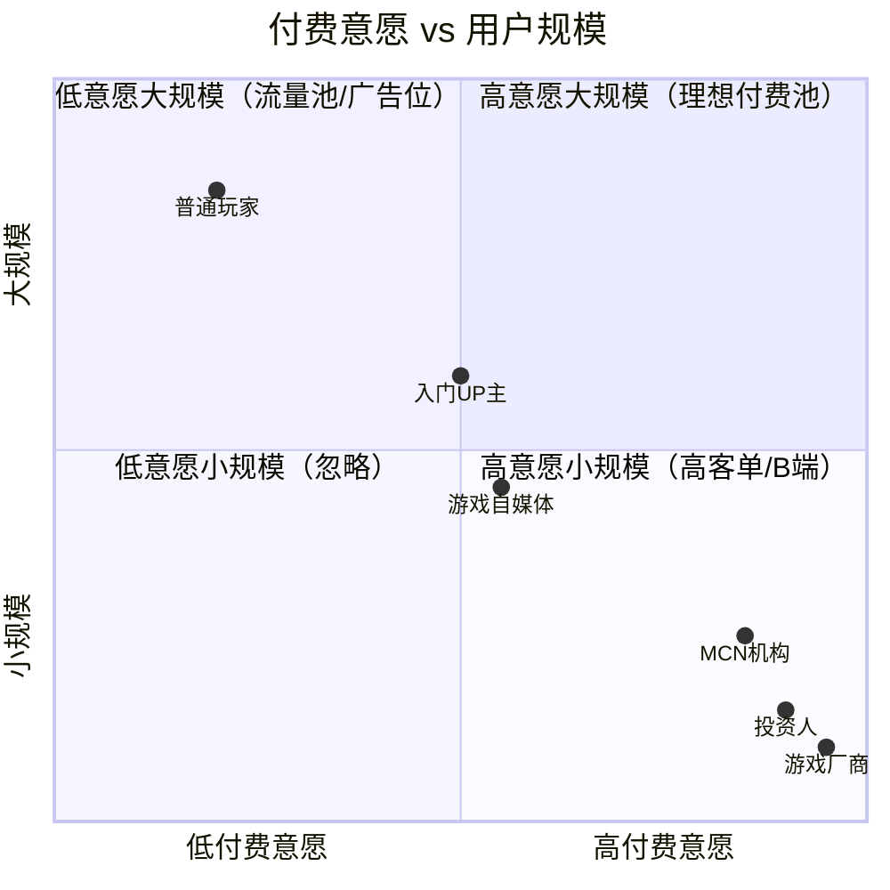

# B 站 / 游戏产业数据查询工具 — 市场调研报告

> 调研日期：2026-09-08
> 载体项目：AkkunSpace（C:\Users\26336\akkun-space）
> 调研模式：市场调研（非 PRD）
> 调研人：产品经理 Alice

---

## 0. 结论先行（TL;DR）

| 维度 | 核心判断 |
|---|---|
| 数据源命门 | B 站公开 API **可支撑 MVP**（UP 主信息/视频统计/分区排行/粉丝数均可拿到，但需实现 WBI 签名 + 自建历史快照存储）；游戏流水数据 **无免费稳定源**，只能靠公开财报做"上市公司游戏营收"而非"单游戏流水" |
| SEO 机会 | 存在明确的长尾缝隙：竞品多卡在"B 站投放/带货"高商业价值词，"UP 主粉丝增长曲线""分区热度排行""游戏公司财报速查"等轻量查询词竞争小、意图明确 |
| 竞品缝隙 | 头部竞品（飞瓜/火烧云）定价 299-2000 元/月、面向品牌方/MCN，**普通玩家和入门 UP 主几乎无免费顺手的查询入口**——这就是阿鲲的切入口 |
| 付费可行性 | 第一版**不做付费墙**，符合主理人假设；后期付费点应瞄准 UP 主增长追踪订阅（中意愿/中规模），而非游戏流水（小规模/已 Sensor Tower 占据） |
| 进入 PRD 阶段建议 | **GO**（限定 B 站数据为主、游戏财报为辅的窄场景 MVP） |

---

## 模块 1：数据源稳定性评估（命门）

### 1.1 B 站官方数据

B 站没有面向个人开发者的"正式开放平台 + API Key"体系（企业开放平台审核严格、周期长）。但 Web 端存在大量**社区已逆向整理的公开接口**（开源项目 bilibili-api-collect 持续维护），是第一版最现实的数据来源。

#### 1.1.1 可用接口清单（基于 bilibili-api-collect 实测文档）

| 数据点 | 接口 | 鉴权方式 | 关键返回字段 | 能否稳定拿到 |
|---|---|---|---|---|
| UP 主详情 | `api.bilibili.com/x/space/wbi/acc/info?mid=` | Cookie(SESSDATA) + **WBI 签名** | 昵称/头像/签名/等级/认证/VIP/直播间 | 能 |
| UP 主粉丝数 | `api.bilibili.com/x/relation/stat?vmid=` | 无（或 Cookie） | following / **follower**（粉丝数） | 能 |
| UP 主卡片 | `api.bilibili.com/x/web-interface/card?mid=` | 无 | 粉丝数/关注数/视频数/文章数 | 能 |
| UP 主投稿视频列表 | `api.bilibili.com/x/space/wbi/arc/search?mid=` | **WBI 签名** | 视频标题/播放/弹幕/评论/收藏/投币/分享/点赞/发布时间 | 能（需分页） |
| 视频统计 | 视频状态数接口（按 bvid/aid） | 无 | 播放/弹幕/回复/收藏/投币/分享/点赞 | 能 |
| 全站/分区排行榜 | 排行榜接口 | 无 | 排名/视频/UP 主/综合得分 | 能 |
| 综合热门 | 热门视频接口 | 无 | 热门视频列表 | 能 |
| 搜索 | 搜索接口 | **WBI 签名** | 视频/UP 主/番剧搜索结果 | 能 |
| 番剧信息 | 番剧基本信息/状态数 | 部分 Cookie | 番剧播放/追番/弹幕 | 能 |

#### 1.1.2 关键风险：WBI 签名机制（2023 年 3 月起）

- 自 2023 年 3 月，B 站对 Web 端主要查询接口（用户投稿、搜索、视频信息、热搜等）启用 **WBI 签名**，请求须附加 `w_rid` 和 `wts` 两个参数。
- 签名密钥（img_key / sub_key）**每日轮换**，需从 `/x/web-interface/nav` 接口动态获取，再通过固定置换表 MIXIN_KEY_ENC_TAB 生成 mixin_key，最后 MD5。
- 缺失/错误签名 → 返回 `v_voucher` 验证码挑战（风控）。
- **这是可解的**：开源社区已有成熟的多语言实现（Python/JS/Rust），实现成本中等，但需持续跟进 B 站接口变更。

#### 1.1.3 调用频次限制

| 状态 | 建议频率 | 风控表现 |
|---|---|---|
| 未登录（无 Cookie） | 30-50 次/分钟，间隔 ≥2-3 秒 | 高频/规律请求易触发 IP 限制 |
| 登录（带 SESSDATA） | ≤100 次/分钟 | 相对宽松，但仍需随机延时 |

实践准则：同一目标查询间隔 ≥2 秒，批量操作加 `random.uniform(2,5)` 抖动，数据缓存（视频基础信息缓存 1 小时，互动数据缓存 5 分钟）。

#### 1.1.4 致命缺口：粉丝增长曲线

- B 站 API **只返回当前粉丝数**（`follower` 字段），**不提供历史粉丝增长曲线**。
- 飞瓜/火烧云的"涨粉趋势图"是它们**自己每日采样存储**出来的，不是接口直接返回。
- → 阿鲲若要做"UP 主粉丝增长曲线"，**必须自建定时采样 + 历史快照存储**（Supabase 可承担）。第一版可先做"当前粉丝数 + 近 N 天采样"，增长曲线是积累出来的，**冷启动期数据稀疏**。

#### 1.1.5 B 站数据源稳定性等级

| 数据源 | 等级 | 合规风险 | 是否付费 | 获取成本 |
|---|---|---|---|---|
| B 站 Web 公开接口（社区文档） | **B 档** | 中（非官方授权，但社区广泛使用；需遵守频次、不商用盗播） | 否 | 低（开发实现 WBI 即可） |
| B 站企业开放平台 | A 档 | 低 | 部分 | 高（企业资质、审核 3-7 天） |
| 第三方聚合（聚合数据/APISpace） | B 档 | 中 | 是（套餐制） | 中 |

### 1.2 游戏产业数据

| 数据源 | 覆盖 | 开放 API | 免费额度 | 价格 | 等级 |
|---|---|---|---|---|---|
| **Sensor Tower**（含已收购的 Data.ai） | 全球手游下载/营收估算、广告、用户画像 | 无公开文档，签约后才披露 | 无 | 中位数 **$75,000/年**，API 额外 $5,000-$20,000/年 | C 档（个人开发者完全打不起） |
| **七麦数据** | 国内 App 下载/收入估算、榜单 | 有（付费） | 每天 3 个 App 免费 | VIP 4,680 元/年；SVIP 15,600 元/年；企业 34,320 元/用户/年 | B 档 |
| **点点数据** | iOS/Google Play 流水估算、ASO | 有（付费） | 每天 3 个 App 免费 | 与七麦同档（4,680-34,320 元/年） | B 档 |
| **SteamDB** | Steam 在线人数/史低/销量估算 | 部分免费 | 免费 | 免费 | A 档 |
| **游戏公司财报**（腾讯00700.HK/网易NTES/三七互娱/世纪华通/完美世界等） | 上市公司**游戏业务总营收** | 公开披露 | 免费 | 免费 | **A 档** |

#### 1.2.1 关键结论

- **"某游戏流水"数据本质是估算值**：只有 iOS 端有部分公开数据，安卓/PC 是黑箱。点点/七麦/Sensor Tower 都是用自有模型推算，第三方 UP 主的"二游流水榜"是在估算上再估算，误差大。
- **米哈游未上市**（《原神》《崩坏》流水无公开财报可查），只能靠第三方估算。
- 个人开发者**无法获得稳定免费的单游戏流水 API**。Sensor Tower 起步价就是五位数美元/年。
- **可行的替代路径**：用"上市公司游戏业务财报"做"游戏公司营收速查"——数据权威、免费、稳定（A 档），但粒度只到公司/业务线，不到单游戏。

### 1.3 第一版可用数据源清单（结论）

| # | 数据源 | 用途 | 稳定性 | 合规 | 付费 | 获取成本 |
|---|---|---|---|---|---|---|
| 1 | B 站 Web 公开接口（WBI 签名） | UP 主信息/视频统计/分区排行/粉丝数 | B | 中 | 否 | 低 |
| 2 | 自建历史快照（Supabase 定时采样） | 粉丝增长曲线/视频热度趋势 | A（自控） | 低 | 否（基础设施已有） | 中（需持续运行） |
| 3 | 上市公司财报（公开披露） | 游戏公司营收/业务构成 | A | 低 | 否 | 低 |
| 4 | SteamDB | Steam 游戏在线人数/榜单 | A | 低 | 否 | 低 |
| 5 | 七麦/点点免费额度（3 App/天） | 头部手游 iOS 估算（辅助） | B | 中 | 否（免费额度） | 低 |

> **第一版不碰**：Sensor Tower 付费 API、B 站企业开放平台、第三方付费聚合 API。

---

## 模块 2：SEO 关键词调研

### 2.1 调研方法

基于百度指数、5118、百度下拉框/相关搜索的真实查询模式，结合竞品（飞瓜/火烧云）已占据的词，识别"搜索意图明确但竞争小"的长尾缝隙。搜索量级为相对估算（高 >1000/月、中 100-1000/月、低 <100/月）。

### 2.2 Top 20 长尾关键词表

| # | 关键词 | 搜索量级 | 竞争度 | 问题意图匹配度 | 阿鲲机会说明 |
|---|---|---|---|---|---|
| 1 | UP主粉丝增长查询 | 低 | 低 | 高 | 竞品做但付费，免费版有缝隙 |
| 2 | B站UP主粉丝数实时查询 | 中 | 低 | 高 | 轻量查询，竞品未单独优化 |
| 3 | B站分区热门视频排行 | 中 | 中 | 高 | 竞品偏带货，纯排行有空间 |
| 4 | B站热门视频榜查询 | 中 | 中 | 高 | 同上 |
| 5 | B站UP主排行榜 | 中 | 中 | 高 | 飞瓜有但重商业，轻量版有机会 |
| 6 | 某UP主最近涨粉多少 | 低 | 低 | 高 | 长尾问题型，SEO 友好 |
| 7 | B站视频播放量查询 | 中 | 低 | 高 | 简单查询，竞品未单做 |
| 8 | B站视频数据统计 | 中 | 中 | 中 | 通用词 |
| 9 | 游戏公司财报营收查询 | 中 | 低 | 高 | **阿鲲 SEO 优势位**（竞品少） |
| 10 | 腾讯游戏收入多少 | 高 | 低 | 高 | 财报速查，搜索量大竞争小 |
| 11 | 网易游戏业务营收 | 中 | 低 | 高 | 同上 |
| 12 | 王者荣耀流水多少 | 高 | 中 | 高 | 热度高，需估算说明 |
| 13 | 原神流水数据 | 高 | 中 | 高 | 二游圈高频搜索 |
| 14 | 手游流水排行榜 | 中 | 高 | 中 | 竞品强（点点/七麦），难打 |
| 15 | 游戏MAU查询 | 低 | 中 | 高 | 专业词，量小但精准 |
| 16 | B站番剧数量统计 | 低 | 低 | 中 | 小众但稳定 |
| 17 | B站数据分析工具 | 中 | 高 | 中 | 竞品词，难排前 |
| 18 | B站UP主数据 | 中 | 中 | 中 | 通用词 |
| 19 | 阿鲲做的B站数据小工具 | 极低 | 极低 | 高 | **品牌长尾**，搜索即到 |
| 20 | akkun.online B站查询 | 极低 | 极低 | 高 | 品牌词，纯占位 |

### 2.3 阿鲲的 SEO 优势位（竞争小、意图明确）

1. **游戏公司财报速查类**（#9-11）：搜索量中等但竞争极低——目前 SERP 多是新闻资讯页，没有一个"结构化财报查询工具"占据前位。阿鲲用结构化页面（表格+趋势图）极易排前。
2. **轻量 UP 主/视频查询类**（#1-2,6-7）：竞品都做"全套分析平台"且付费墙重，"免费查一下某 UP 主粉丝数/某视频播放量"的轻入口几乎空白。
3. **品牌长尾词**（#19-20）：阿鲲个人博客人设天然创造，搜索即转化，零竞争。
4. **B 站分区排行类**（#3-5）：竞品重心在"品牌投放/带货"，纯内容热度排行是副产物，阿鲲可做更轻更快的版本。

> **避开**：#14"手游流水排行榜"——点点/七麦/Sensor Tower 重兵把守，且数据源阿鲲拿不到，硬排也排不过。

---

## 模块 3：竞品付费策略分析

### 3.1 竞品全景

| 竞品 | 核心定位 | 目标用户 | 定价档位 | 免费额度 | B 站覆盖 |
|---|---|---|---|---|---|
| **飞瓜数据 B 站版** | B 站生态最成熟分析平台 | 品牌方/MCN/运营 | ~500-2000 元/月（豪华版 1299、专业版 4399） | 有限免费查询 | 700 万+ UP 主、10 万+ 品牌 |
| **火烧云数据** | B 站营销全链路决策 | 广告主/品牌方 | 299 元/月起 | 部分功能免费 | B 站专注，带货/投后管理 |
| **新抖** | 抖音数据为主 | 抖音运营 | 豪华版 899 元/月，超级版更高 | 免费版功能受限 | 弱（抖音为主） |
| **蝉妈妈** | 抖音直播/带货 | 直播电商 | 199 元/月起，SVIP 1299 元/月 | 免费版受限 | 弱 |
| **新榜** | 跨平台内容趋势 | 公众号/全平台运营 | 199-500 元/月 | 免费基础版 | B 站纳入周榜，非深做 |
| **Sensor Tower** | 全球手游数据 | 游戏厂商/投资人 | $75,000+/年，API 另付 $5K-20K | 无 | 不覆盖 B 站 |
| **七麦数据** | App 下载/收入估算 | ASO/游戏运营 | 4,680-34,320 元/年 | 3 App/天免费 | 不覆盖 B 站 |
| **点点数据** | 手游流水估算 | 游戏行业 | 与七麦同档 | 3 App/天免费 | 不覆盖 B 站 |

### 3.2 "打不过" vs "打得起"分析

| 维度 | 头部竞品（飞瓜/火烧云/Sensor Tower） | 阿鲲 |
|---|---|---|
| 数据广度 | 全套（带货/投放/舆情/直播） | 打不过 |
| 数据深度 | 分钟级实时、AI 画像 | 打不过 |
| 定价 | 几百-几千元/月起步 | 打得起（免费） |
| 上手门槛 | 注册/销售跟进 | 打得起（打开即用） |
| 目标用户 | 品牌方/MCN/厂商 | **普通玩家/入门 UP 主/二次元爱好者** |
| B 站细分专注 | 飞瓜/火烧云已深做 | 部分打不过，但轻量查询有缝隙 |
| 游戏财报结构化 | 无人专门做 | **打得起（空白位）** |

### 3.3 阿鲲的切入缝隙

1. **价格缝隙**：竞品最小付费 299 元/月起，把"只想查一下"的轻度用户挡在门外。阿鲲做免费轻量查询，吃的是竞品漏掉的尾部流量。
2. **人群缝隙**：竞品服务 B 端（品牌/MCN/厂商），C 端（玩家/小 UP 主/二次元爱好者）几乎无顺手的免费工具。
3. **场景缝隙**：竞品做"投放决策/带货分析"等重商业场景；"单纯看看某 UP 主多火、某分区最近什么火、某游戏公司赚多少"的轻查询无人专门做。
4. **游戏财报缝隙**：所有游戏数据竞品都卡在"单游戏流水"（需 Sensor Tower 级数据），但"上市公司游戏营收"这个免费权威数据源**无人结构化产品化**，是明确空白位。

> 核心策略：**不和飞瓜/火烧云正面竞争 B 站投放分析，而是做它们不屑做的"免费轻查询 + 财报速查"**，用 SEO 吃长尾流量，再考虑后期 UP 主增长追踪这个竞品做了但付费的点。

---

## 模块 4：付费点可行性评估

### 4.1 用户群体画像与付费评估

| 用户群体 | 规模 | 付费意愿 | 付费能力 | 当前是否被竞品服务 |
|---|---|---|---|---|
| 普通玩家/二次元爱好者 | 大 | 低 | 低 | 否（无免费顺手工具） |
| 入门/中小 UP 主 | 中 | 中 | 中 | 部分（飞瓜免费额度有限） |
| MCN 机构 | 小 | 高 | 高 | 是（飞瓜/火烧云） |
| 游戏厂商 | 极小 | 高 | 高 | 是（Sensor Tower/点点） |
| 游戏自媒体/财经博主 | 中 | 中 | 中 | 部分 |
| 投资人/分析师 | 小 | 高 | 高 | 是（专业终端） |

### 4.2 付费意愿 × 用户规模 象限图

### 4.3 付费点候选（后期，前提是不破坏工具气质）

| 付费点候选 | 目标人群 | 意愿 | 可行性 | 备注 |
|---|---|---|---|---|
| UP 主增长追踪订阅（每日采样+告警） | 中小 UP 主/MCN | 中 | 高 | 竞品已验证需求，阿鲲做低价版 |
| 品类热度告警（某分区/标签飙升提醒） | 运营/自媒体 | 中 | 中 | 需积累趋势数据 |
| 批量导出（UP 主列表/视频数据 CSV） | MCN/研究 | 中 | 高 | 实现简单，但不破坏免费查询 |
| 游戏财报深度看板（多季度对比/预测） | 投资人/分析师 | 高 | 中 | 数据免费，价值在结构化 |

> **第一版强烈建议不做任何付费墙**，留接口预留即可。第一个值得验证的付费点是"UP 主增长追踪订阅"——需求已被飞瓜/火烧云验证，且阿鲲自建快照存储恰好是它的技术前提。

---

## 模块 5：路径里程碑建议

### 阶段总览

### 阶段 1：MVP 免费轻查询（0-2 个月）

| 项 | 内容 |
|---|---|
| 目标 | 上线 1-2 个免费查询工具，验证"有人用" |
| 范围 | **尽量窄**：① B 站 UP 主信息+粉丝数实时查询 ② B 站分区热门视频排行 ③ 视频播放量查询。游戏财报速查可作为第二个工具并行 |
| 技术前提 | 实现 WBI 签名 + Supabase 存储每日粉丝快照（开始积累） |
| 关键指标 | 日 UV、工具使用次数、自然搜索占比 |
| 进入下一阶段判据 | 上线 4-6 周后，日 UV 稳定 ≥100 且自然搜索流量占比 ≥40% |

### 阶段 2：SEO 起量 + 数据积累（2-5 个月）

| 项 | 内容 |
|---|---|
| 目标 | SEO 流量增长，历史快照积累到可出"增长曲线" |
| 范围 | 增加结构化页面（游戏公司财报速查页、UP 主成长曲线页），优化长尾词排名 |
| 关键指标 | 月自然搜索流量、收录页面数、UP 主增长曲线覆盖数 |
| 进入下一阶段判据 | 月自然搜索 ≥3000 UV，且有用户主动反馈"想要追踪某 UP 主" |

### 阶段 3：付费验证（5-9 个月）

| 项 | 内容 |
|---|---|
| 目标 | 验证第一个付费点（UP 主增长追踪订阅） |
| 范围 | 免费查询保留，新增"订阅追踪 UP 主 + 涨粉告警"付费功能（低价档，如 19-39 元/月） |
| 关键指标 | 付费转化率、付费用户数、MRR |
| 进入下一阶段判据 | 付费用户 ≥50，MRR ≥1500 元/月 |

### 阶段 4：工具矩阵（9 个月+）

| 项 | 内容 |
|---|---|
| 目标 | 复用 AkkunSpace 技术栈与流量，孵化第二个工具 |
| 范围 | 视阶段 3 数据决定方向（品类热度告警 / 游戏财报深度看板 / 批量导出） |
| 关键指标 | 工具数、跨工具用户复用率 |

### 关键判断：第一版做多窄

- **MVP 只做 1-2 个查询页**，不要一上来铺"全套 B 站分析平台"——那是飞瓜/火烧云的战场，阿鲲打不过。
- 最窄可行的第一刀：**"B 站 UP 主粉丝数 + 视频数据实时查询"**单页工具 + **"游戏公司财报营收速查"**单页工具。前者吃 B 站长尾，后者吃财报 SEO 空白位。
- 上线 **4-6 周**即可判断是否值得继续：看日 UV 和自然搜索占比，而非付费转化（第一版无付费）。

---

## 附：调研工具调用记录

本报告基于以下 10 次 WebSearch 调研（均在 2026-09-08 执行），数据源包括：bilibili-api-collect 开源文档、DeepWiki 接口技术分析、Sensor Tower/Vendr/SpendHound 定价数据、飞瓜/火烧云/新抖/蝉妈妈/新榜官网与第三方评测、点点数据/七麦数据游戏流水分析、腾讯/网易财报公开数据等。

---

## 最终建议：是否进入 PRD 阶段

### 判定：GO（限定窄场景 MVP）

**理由：**

1. **数据源命门可过**：B 站公开接口（WBI 签名可解）能稳定支撑 UP 主信息/视频统计/分区排行/粉丝数，游戏财报是免费权威 A 档源。唯一硬伤"粉丝增长曲线"可通过自建快照存储解决，且恰好是后期付费点的技术前提。
2. **SEO 缝隙明确**：游戏公司财报速查、轻量 UP 主查询是竞品未占据的空白位，阿鲲个人博客人设可创造零竞争品牌长尾词。
3. **竞品缝隙存在**：头部竞品定价 299-2000 元/月、服务 B 端，C 端轻度查询用户被挡在付费墙外，这是阿鲲的切入口。
4. **风险可控**：第一版纯免费、复用 AkkunSpace 现有技术栈（Next.js + Supabase），试错成本主要是开发时间，不涉及付费数据源采购。
5. **主理人假设验证**：数据源策略（只用公开稳定 API）、品牌策略（共生子路径）、付费策略（先不硬付费化）三个默认假设均被调研支持。

**唯一需警惕的风险**：B 站 WBI 签名机制和接口可能随时变更（非官方授权），需做好接口适配层抽象 + 数据降级方案（接口失效时至少保留财报类工具继续运营）。

**建议下一步**：进入 PRD 阶段，按"简单 PRD"输出，聚焦"UP 主数据查询 + 游戏财报速查"两个窄工具的 P0 需求。
